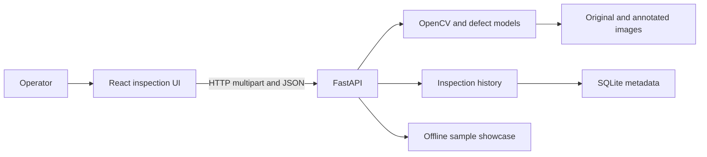

# Architecture

## Status

The React operator UI, FastAPI service, multi-model detection runtime,
SQLite/media persistence, history/export/live endpoints, and model-aware sample
showcase are implemented. The default detector is the category-guided Bayes-PFL
general anomaly localizer; steel and concrete specialists remain available for
known domains. See `docs/project-status.json` for the current baseline and
limitations.

## System context



## Components

### Frontend app

- Root: `frontend`.
- Owns routing, upload interaction, Canvas overlays, history UI, real/mock API
  selection, live frame capture, CSV download, and client-side quality fallback.
- Uses relative `/api` URLs by default through the Vite development proxy.
- Uses one global model selector on Dashboard, Inspect, and Samples.
- When the API marks a model `requiresProductName`, the selector also requests a
  concrete product/category string and sends it with upload and stream calls.
- Model or product-context changes abort in-flight requests before clearing the
  current upload result.
- Displays original pixels without CSS color transforms; Canvas is a separate
  overlay.
- Sample recommendations never silently change the selected model.

### Backend API

- Root: `backend/routes`, application entrypoint `backend/main.py`.
- Owns environment validation, lifespan composition, CORS, multipart/content
  validation, response serialization, inference locking, and error mapping.
- Implements `POST /api/inspect`, `POST /api/stream`, `GET /api/export`,
  list/detail/delete history, history clear, and sample list/image endpoints.
- `modelId` selects the registered detector. `productName` is required only for
  category-guided models and is rejected with a validation response when absent.
- One lazy runtime manager and one inference lock are shared by the application.
  Successful services are cached by `(model ID, product context)` so guided
  prompts do not mutate another cached request context.
- Stream inference does not persist records; upload inference persists metadata,
  original bytes, and annotated media through the storage service.

### Defect detection

- Root: `backend/detection`.
- Also owns `backend/utils/preprocessing.py`, `backend/utils/model_loader.py`, and
  `scripts/install_models.py` as declared repository boundaries.
- Validates the model manifest and artifact integrity before model construction.
- Supports `auto | cpu | cuda | cuda:N` device selection.
- Keeps model-native class names; there is no semantic class remapping layer.
- `DetectionService` owns common native-class validation, quality scoring,
  annotation, and DTO construction.

Ultralytics detectors use service-owned geometry:

```text
original BGR
-> square letterbox
-> registered preprocessing profile
-> Ultralytics detector
-> restore once to original coordinates
-> shared DTO/quality/annotation
```

Anomaly-map detectors use backend-owned geometry:

```text
original BGR
-> model-specific stretch and normalization
-> anomaly map and model-specific postprocessing
-> backend restores boxes to original coordinates once
-> shared DTO/quality/annotation
```

`bayespfl-general-v1` is the default. It uses Bayes-PFL with the VisA-trained
checkpoint, explicit product/category prompting, `518×518` CLIP preprocessing,
Gaussian sigma `8`, fixed application threshold `0.72`, minimum component area
ratio `0.0005`, and a 25% bbox display margin. Its native type is `anomaly`; the
confidence is an anomaly-component score rather than a semantic class
probability. Structural relationship defects are not presented as a guaranteed
strength of this model, so domain specialists remain preferable when available.

Bayes-PFL model binaries are size/SHA-256 verified. The minimal inference source
set is installed from a pinned upstream revision and checked against exact Git
blob IDs, so users do not need a separate source checkout. The downloaded
runtime remains untracked. A single upstream CUDA-only allocation is adapted in
memory to the active tensor device while the pinned source file on disk remains
unchanged.

### Inspection history

- Root: `backend/storage`.
- Owns SQLite metadata, stable relative media paths, filtering, transactional
  creation, deletion, clearing, and startup reconciliation.
- List responses omit image bodies; detail responses hydrate original and
  annotated data URLs.
- CSV export reuses the same history filters and newest-first query path.

### Shared contracts

- Root: `shared` plus the declared `backend/models/record.py` contract path.
- Owns stable response schemas and documented DTO semantics only.

### Verification evidence

- Root: `docs/evidence`.
- Owns reproducible command outputs and sanitized runtime artifacts mapped by
  `docs/verification.md`.
- Existing recorded artifacts remain historical records of the source they
  actually executed. New final runtime results are recorded only after the
  integrated source is executed; manual exploratory runs are not rewritten as
  production evidence.

## Boundary rules

- Frontend never imports backend Python or reads backend storage directly.
- API routes call detection and history through public services.
- Detection never writes inspection records.
- History never loads or runs a model.
- Shared contracts depend on no higher-level module.
- Verification tooling may inspect public outputs but is not a runtime dependency.

## Inspection sequence


## Deferred decisions

Production threshold calibration against a larger labeled deployment set and a
formal cross-domain accuracy benchmark remain outside the current product scope.
