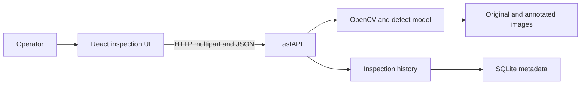
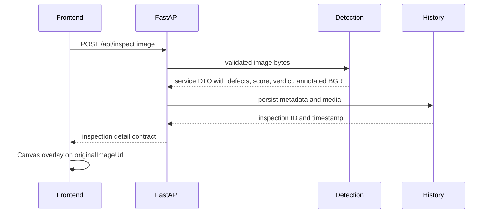

# Architecture

## Status

The frontend application, its real-API boundary, reusable multiclass core, and
selected-model inspection service are implemented. Both registered models have
core probe evidence, and the selected model has full preprocessing, annotation,
and quality-score evidence. Backend API, persistence, and the final demo dataset
remain planned. See
`docs/project-status.json` for the precise baseline and limitations.

## System context

## Components

### Frontend app

- Root: `frontend`.
- Owns routing, upload interaction, Canvas overlays, history UI, real/mock API
  selection, live frame capture, CSV download, and client-side severity fallback.
- Calls only interfaces defined in `docs/api-contract.md`.
- Implemented and build-verified.

### Backend API

- Root: `backend/routes` with application entrypoint `backend/main.py`.
- Will own HTTP validation, response serialization, CORS, error mapping, and route
  composition.
- Must not contain model inference or persistence implementation.
- Planned.

### Defect detection

- Root: `backend/detection`.
- Also owns the required `backend/utils/preprocessing.py` and
  `backend/utils/model_loader.py` paths declared explicitly in `module-map.json`.
- Implements model integrity checks, `auto | cpu | cuda | cuda:N` selection,
  Ultralytics loading, multiclass inference, bbox clamping, and normalized core
  DTOs independent of Ultralytics result objects.
- Implements the production `DetectionService`: one 640-square letterbox,
  grayscale, CLAHE, three-channel conversion, selected-model inference, one
  restore to original coordinates, explicit identity class mapping, annotation,
  `quality-v1`, and passed/failed verdict.
- Rejects the 17-class alternative at the service boundary unless a separate
  explicit mapping is supplied; the generic core continues to support it.
- Does not own HTTP routes, inspection history, video processing, tracking,
  scheduling, media encoding, or persistence.
- Core inference is runtime-verified for both models; full service inference is
  runtime-verified for the selected six-class model at confidence `0.25`.

### Inspection history

- Root: `backend/storage`.
- Will own SQLite metadata, media paths, filtering, deletion, clearing, and CSV
  projection.
- List responses omit image bodies; detail responses hydrate both image fields.
- Planned.

### Shared contracts

- Root: `shared`.
- Owns stable cross-module schemas and documented DTO semantics only.
- It must not depend on application, model, or persistence implementation.

### Audit evidence

- Root: `docs/evidence`.
- Owns reproducible command output and runtime artifacts mapped by
  `docs/audit-evidence.md`.
- Evidence is immutable per verified milestone and may not contain secrets, host
  paths, large model weights, or personal data.

## Boundary rules

- Frontend never imports backend Python or reads backend storage directly.
- API routes call detection and history through their public services.
- Detection never writes inspection records.
- History never loads or runs a model.
- Shared contracts depend on no higher-level module.
- Audit tooling may inspect public outputs but must not become a runtime dependency.

## Inspection sequence

## Deferred decisions

The primary runtime model is registered in `backend/models/model-manifest.json`.
FastAPI serialization, JPEG/data URL encoding, production confidence calibration,
storage, and a redistributable ten-image demo dataset remain deferred.
