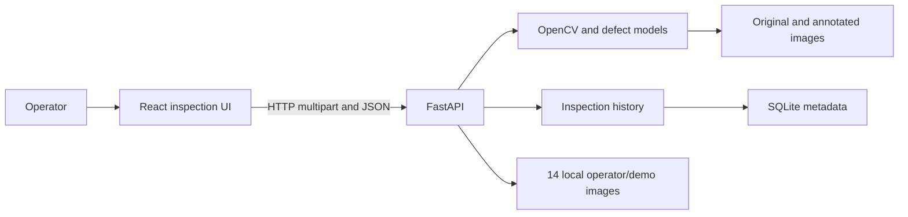
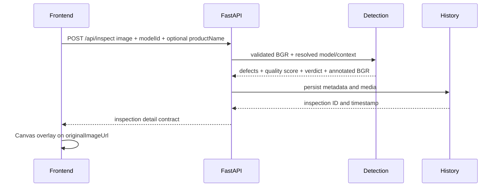

# Architecture

## Status

The React operator UI, FastAPI service, multi-model detection runtime,
SQLite/media persistence, history/export/live endpoints, and curated operator
sample showcase are implemented. The default detector is the category-guided
Bayes-PFL general anomaly localizer; steel and concrete specialists remain
independently selectable for known domains. The rejected legacy general YOLO
remains registered only for historical reproducibility and is not exposed to
operators. See `docs/project-status.json` for the current baseline and limitations.

## System context



## Components

### Frontend app

- Root: `frontend`.
- Owns routing, upload interaction, Canvas overlays, history UI, real/mock API
  selection, live frame capture, CSV download, and client-side quality fallback.
- Uses relative `/api` URLs by default through the Vite development proxy.
- Uses one global model selection state on Dashboard, Inspect, and Samples.
- When the API marks a model `requiresProductName`, the selector exposes an
  editable combobox populated from tracked curated examples while still allowing
  custom zero-shot product/category values.
- Model choice and product/category choice are independent. Choosing a steel or
  concrete category never silently routes to a specialist.
- Model or product-context changes abort in-flight requests before clearing the
  current upload result.
- Displays original pixels without CSS color transforms; Canvas is a separate
  overlay.
- A showcase sample supplies its own product/category context but never changes
  the selected model automatically.

### Backend API

- Root: `backend/routes`, application entrypoint `backend/main.py`.
- Owns environment validation, lifespan composition, CORS, multipart/content
  validation, response serialization, inference locking, and error mapping.
- Implements `POST /api/inspect`, `POST /api/stream`, `GET /api/export`,
  list/detail/delete history, history clear, and sample list/image endpoints.
- `modelId` selects an exposed detector. Guided `productName` context is
  normalized to lowercase, accepts `_` as a backwards-compatible space
  separator, and is constrained to 2-40 characters, Latin letters/spaces/
  hyphens, and at most three words. Invalid guided context maps to HTTP 422.
- One lazy runtime manager and one inference lock are shared by the application.
  Successful detection services are cached once per model ID. Guided product
  context is updated on the cached detector under that model's lock immediately
  before inference, so concurrent category-guided requests cannot mix prompts
  and do not load duplicate Bayes-PFL/CLIP services.
- Stream inference does not persist records; upload inference persists metadata,
  original bytes, and annotated media through the storage service.
- `backend/routes/sample_catalog.py` defines the fourteen-image operator/demo catalog: eight MVTec Bayes-PFL examples plus three steel and three concrete specialist examples. `/api/samples/{id}/image` serves those exact committed files from `backend/samples/demo/`; arbitrary client paths or URLs are never accepted. The operator catalog and the demo-image acceptance set are the same corpus.

### Defect detection

- Root: `backend/detection`.
- Also owns `backend/utils/preprocessing.py`, `backend/utils/model_loader.py`, and
  `scripts/install_models.py` as declared repository boundaries.
- Validates the model manifest and artifact integrity before model construction.
- Tracks model-selection decisions, curated prompts, excluded prompts, and the
  Bayes cross-dataset protocol in `backend/detection/model-selection.json`.
- Repository tests prevent a registered model marked rejected in selection
  metadata from being exposed in the operator registry.
- Supports `auto | cpu | cuda | cuda:N` device selection.
- Keeps model-native class names; there is no semantic class remapping layer.
- `DetectionService` owns common native-class validation, quality scoring,
  annotation, and DTO construction.
- The AnomalyCLIP adapter and vendored minimal runtime are retained as a
  supported experimental backend slot for reproducibility and future registry
  entries. No currently exposed model uses the `anomalyclip` backend; its
  rejected candidate result remains documented in model-selection history.

Ultralytics detectors use service-owned geometry:

```text
original BGR
-> square letterbox
-> registered preprocessing profile
-> Ultralytics detector
-> restore once to original coordinates
-> shared DTO/quality/annotation
```

Anomaly-map detectors use backend-owned geometry:

```text
original BGR
-> model-specific stretch and normalization
-> anomaly map and model-specific postprocessing
-> backend restores boxes to original coordinates once
-> shared DTO/quality/annotation
```

`bayespfl-general-v1` is the default. It intentionally uses `train_visa.pth`:
VisA is its auxiliary training domain and MVTec AD is the distinct held-out
runtime qualification domain. That relationship is recorded as
`held-out-cross-dataset-zero-shot`; it must not be inverted to
`train_mvtec.pth` while MVTec remains the qualification domain. The local operator/demo corpus is not Bayes-PFL runtime qualification evidence.

The Bayes adapter uses explicit product/category prompting, `518×518` CLIP
preprocessing, Gaussian sigma `8`, fixed application threshold `0.72`, minimum
component area ratio `0.0005`, and a 25% bbox display margin. Its native type is
`anomaly`; the confidence is an anomaly-component score rather than a semantic
class probability. Meaningful prompt context matters: malformed context is
rejected, while curated suggestions are guidance rather than a class whitelist.

The steel and concrete detectors are separate independently trained YOLOv8
weights, not Bayes-PFL modes. They remain manually selectable specifically so a
source can be compared between the broad Bayes localizer and a domain-specific
specialist.

Bayes-PFL model binaries are size/SHA-256 verified. The minimal inference source
set is installed from a pinned upstream revision and checked against exact Git
blob IDs, so users do not need a separate source checkout. The downloaded
runtime remains untracked. A single upstream CUDA-only allocation is adapted in
memory to the active tensor device while the pinned source file on disk remains
unchanged.

### Inspection history

- Root: `backend/storage`.
- Owns SQLite metadata, stable relative media paths, filtering, transactional
  creation, deletion, clearing, and startup reconciliation.
- List responses omit image bodies; detail responses hydrate original and
  annotated data URLs.
- CSV export reuses the same history filters and newest-first query path.
- Frontend defect-type choices are derived from currently exposed model classes;
  hidden/rejected model classes do not pollute the operator filter.

### Shared contracts

- Root: `shared` plus the declared `backend/models/record.py` contract path.
- Owns stable response schemas and documented DTO semantics only.
- The model-list response includes curated product/category examples only for
  guided models.

### Verification evidence

- Root: `docs/evidence`.
- Owns reproducible command outputs and sanitized runtime artifacts mapped by
  `docs/verification.md`.
- Existing recorded artifacts remain historical records of the source they
  actually executed. When detector-bound source changes, the previous runtime
  bundle remains immutable and project status must explicitly say runtime
  requalification is pending.
- New current runtime results are recorded only after the integrated source is
  executed through `DetectionRuntimeManager -> DetectionService`.
- The fourteen operator/demo images are local committed files and require no runtime network access. Runtime model qualification remains a separate verification workflow.

## Boundary rules

- Frontend never imports backend Python or reads backend storage directly.
- API routes call detection and history through public services.
- Detection never writes inspection records.
- History never loads or runs a model.
- Shared contracts depend on no higher-level module.
- Verification tooling may inspect public outputs but is not a runtime dependency.

## Inspection sequence



## Deferred decisions

Production threshold calibration against a larger labeled deployment set and a
formal cross-domain accuracy benchmark remain outside the current product scope.
