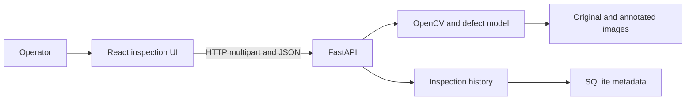
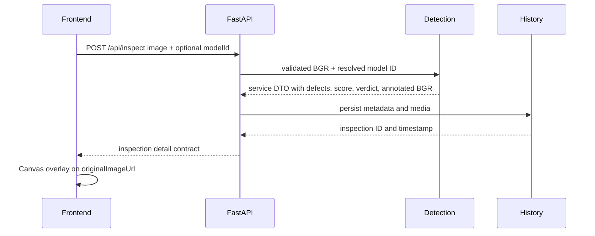

# Architecture

## Status

The frontend application, reusable multiclass core, selected-model inspection
service, SQLite/media persistence, and main FastAPI inspection/history API are
implemented. All registered models have service-level probe evidence. Each requested model
has full preprocessing, HTTP, persistence, deletion, non-persisted stream, and
filtered CSV evidence. Twelve redistributed VisA samples have license, hash,
decode, dimension, source-annotation provenance, and separate selected-model
observations. See
`docs/project-status.json` for the precise baseline and limitations.

## System context

## Components

### Frontend app

- Root: `frontend`.
- Owns routing, upload interaction, Canvas overlays, history UI, real/mock API
  selection, live frame capture, CSV download, and client-side severity fallback.
- Uses relative `/api` URLs by default so development traffic crosses the Vite
  proxy; a cross-origin production base remains an explicit environment option.
- Owns uploaded preview URL cleanup and displays inspection pixels without CSS
  color transforms while Canvas remains a separate overlay.
- Calls only interfaces defined in `docs/api-contract.md`.
- Implemented and build-verified.

### Backend API

- Root: `backend/routes` with application entrypoint `backend/main.py`.
- Owns environment validation, lifespan composition, CORS, multipart/content
  validation, response serialization, inference locking, and error mapping.
- Accepts a configurable positive upload limit with a hard 10 MiB ceiling; the
  tracked environment template is directly loadable by Pydantic Settings.
- Lifespan validates one model registry and creates one lazy runtime manager,
  one storage service, and one shared inference lock. Checkpoints are loaded only
  on first use and successful services remain cached by model ID.
- Implements `POST /api/inspect`, `POST /api/stream`, `GET /api/export`,
  list/detail/delete history, and history clear.
- Stream inference reuses the application service and lock without persistence;
  export reuses the canonical history filters and newest-first query path.
- Keeps model inference and persistence implementation behind their public
  service boundaries.

### Defect detection

- Root: `backend/detection`.
- Also owns the required `backend/utils/preprocessing.py` and
  `backend/utils/model_loader.py` paths declared explicitly in `module-map.json`.
- Implements model integrity checks, `auto | cpu | cuda | cuda:N` selection,
  Ultralytics loading, multiclass inference, bbox clamping, and normalized core
  DTOs independent of Ultralytics result objects.
- Provides a registry installer for the default, one named model, or all models;
  every pinned download is size/SHA verified and atomically installed.
- Implements `standard-color` and `steel-enhanced` manifest profiles over one
  shared letterbox/restore pipeline. The latter adds grayscale and CLAHE.
- `DetectionRuntimeManager` lazy-loads and caches registered models.
  `DetectionService` preserves checkpoint-native class names, applies per-model
  quality weights with an explicit neutral default, annotates original pixels,
  and returns passed/failed without Ultralytics objects.
- Does not own HTTP routes, inspection history, video processing, tracking,
  scheduling, media encoding, or persistence.
- All three registered models are runtime-qualified through the same production
  manager/service path on domain-scoped probes. Probe observations make no
  benchmark-accuracy claim.
- The selected service is also runtime-verified against all twelve tracked VisA
  samples selected by source quotas. Four source-normal samples retain all model
  false positives; source labels never become native model class claims.

### Inspection history

- Root: `backend/storage`.
- Owns SQLite metadata, stable relative media paths, combined SQL filtering,
  transactional creation, deletion, clearing, and restart reconciliation.
- Writes new media through staging; delete/clear use quarantine until SQLite
  commits; compensating cleanup prevents ordinary write/commit failures from
  leaving inconsistent metadata or final media.
- Restores referenced quarantined files and removes interrupted staging plus
  unreferenced media at startup.
- List responses omit image bodies; detail responses hydrate both image fields.
- The HTTP layer persists original bytes unchanged and encodes the annotated copy
  in the detected source format; POST/detail expose both as data URLs.
- Main history endpoints and CSV projection are implemented through the same
  `HistoryFilters` value and repository query.

### Shared contracts

- Root: `shared`.
- Owns stable cross-module schemas and documented DTO semantics only.
- It must not depend on application, model, or persistence implementation.

### Verification evidence

- Root: `docs/evidence`.
- Owns reproducible command output and runtime artifacts mapped by
  `docs/verification.md`.
- Evidence is immutable per verified milestone and may not contain secrets, host
  paths, large model weights, or personal data.
- The demo manifest and CC BY 4.0 attribution bind twelve unmodified images to
  archive paths, hashes, dimensions, and four tracked `image_anno.csv` files.
- `sourceGroundTruth` is annotation-backed; `modelObservation` is reproduced at
  confidence `0.25` and explicitly makes no accuracy claim.

## Boundary rules

- Frontend never imports backend Python or reads backend storage directly.
- API routes call detection and history through their public services.
- Detection never writes inspection records.
- History never loads or runs a model.
- Shared contracts depend on no higher-level module.
- Verification tooling may inspect public outputs but must not become a runtime dependency.

## Inspection sequence

## Deferred decisions

The primary runtime model is registered in `backend/models/model-manifest.json`.
Production confidence calibration and the final evidence `sourceCommit`
rebinding remain deferred.
