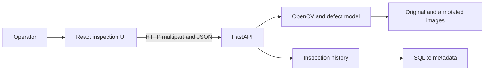
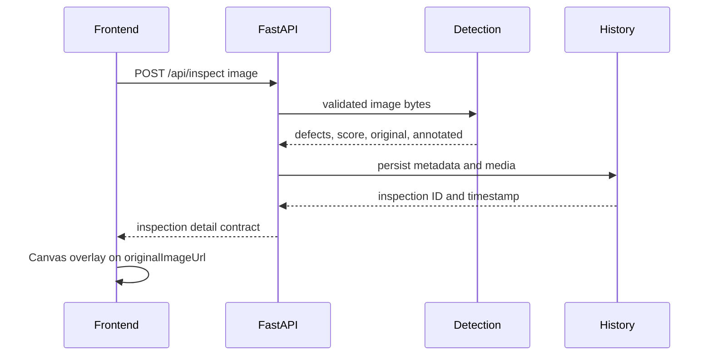

# Architecture

## Status

The frontend application and its real-API boundary are implemented. Backend API,
OpenCV preprocessing, real model inference, persistence, demo datasets, and
runtime evidence are planned. See `docs/project-status.json` for the precise
baseline and limitations.

## System context

## Components

### Frontend app

- Root: `frontend`.
- Owns routing, upload interaction, Canvas overlays, history UI, real/mock API
  selection, live frame capture, CSV download, and client-side severity fallback.
- Calls only interfaces defined in `docs/api-contract.md`.
- Implemented and build-verified.

### Backend API

- Root: `backend/routes` with application entrypoint `backend/main.py`.
- Will own HTTP validation, response serialization, CORS, error mapping, and route
  composition.
- Must not contain model inference or persistence implementation.
- Planned.

### Defect detection

- Root: `backend/detection`.
- Will own OpenCV preprocessing, model lifecycle, inference, coordinate mapping,
  annotation, and backend quality scoring.
- The model is loaded once and configured only through the environment/model
  contract.
- Planned.

### Inspection history

- Root: `backend/storage`.
- Will own SQLite metadata, media paths, filtering, deletion, clearing, and CSV
  projection.
- List responses omit image bodies; detail responses hydrate both image fields.
- Planned.

### Shared contracts

- Root: `shared`.
- Owns stable cross-module schemas and documented DTO semantics only.
- It must not depend on application, model, or persistence implementation.

### Audit evidence

- Root: `docs/evidence`.
- Owns reproducible command output and runtime artifacts mapped by
  `docs/audit-evidence.md`.
- Evidence is immutable per verified milestone and may not contain secrets, host
  paths, large model weights, or personal data.

## Boundary rules

- Frontend never imports backend Python or reads backend storage directly.
- API routes call detection and history through their public services.
- Detection never writes inspection records.
- History never loads or runs a model.
- Shared contracts depend on no higher-level module.
- Audit tooling may inspect public outputs but must not become a runtime dependency.

## Inspection sequence

## Deferred decisions

The exact licensed manufacturing-defect model and dataset source remain open.
Their choice must be recorded with version, license, source, hash, classes, and
runtime evidence before AI integration is marked implemented.
