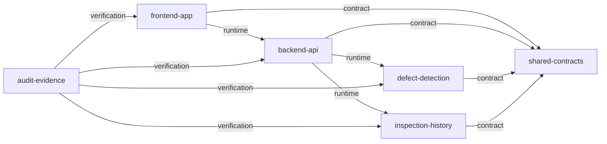

# Generated dependency graph

Generated from `dependency-graph.json`; do not edit this file manually.

## Allowed dependencies

| From | To | Type | Rationale |
| --- | --- | --- | --- |
| frontend-app | backend-api | runtime | The frontend calls only the documented FastAPI HTTP surface. |
| frontend-app | shared-contracts | contract | The frontend consumes stable inspection and error DTO semantics. |
| backend-api | defect-detection | runtime | The inspection route invokes the public detection service; stream remains deferred. |
| backend-api | inspection-history | runtime | API routes persist, query, and delete inspection records through the history service; export remains deferred. |
| backend-api | shared-contracts | contract | FastAPI validates and serializes the shared DTOs. |
| defect-detection | shared-contracts | contract | Detection emits normalized defects independent of model-library objects. |
| inspection-history | shared-contracts | contract | Persistence stores and returns shared inspection semantics. |
| audit-evidence | frontend-app | verification | Audit checks verify the public frontend build and behavior. |
| audit-evidence | backend-api | verification | Integration tests and loopback HTTP evidence verify the public inspection and history API. |
| audit-evidence | defect-detection | verification | Audit evidence verifies model integrity, preprocessing, service inference, scoring, and annotation outputs. |
| audit-evidence | inspection-history | verification | Unit and loopback HTTP evidence verify history persistence and media consistency; CSV remains deferred. |

## Forbidden dependencies

| From | To | Reason |
| --- | --- | --- |
| frontend-app | defect-detection | The browser must use the backend API and never run or import server detection code. |
| frontend-app | inspection-history | The browser must not access backend persistence directly. |
| backend-api | frontend-app | The backend must remain independent of React implementation. |
| defect-detection | backend-api | Detection is a lower-level service and must not import HTTP routes. |
| defect-detection | inspection-history | Detection returns results and does not persist records. |
| inspection-history | backend-api | Persistence is a lower-level service and must not import HTTP routes. |
| inspection-history | defect-detection | History never loads or executes a model. |
| shared-contracts | frontend-app | Shared contracts must remain independent of application code. |
| shared-contracts | backend-api | Shared contracts must remain independent of API implementation. |
